# EDA & Preprocessing

### Import Libraries


### Read csv


### Head df

```
##        City       Date PM2.5 PM10    NO   NO2   NOx NH3    CO   SO2     O3
## 1 Ahmedabad 2015-01-01    NA   NA  0.92 18.22 17.15  NA  0.92 27.64 133.36
## 2 Ahmedabad 2015-01-02    NA   NA  0.97 15.69 16.46  NA  0.97 24.55  34.06
## 3 Ahmedabad 2015-01-03    NA   NA 17.40 19.30 29.70  NA 17.40 29.07  30.70
## 4 Ahmedabad 2015-01-04    NA   NA  1.70 18.48 17.97  NA  1.70 18.59  36.08
## 5 Ahmedabad 2015-01-05    NA   NA 22.10 21.42 37.76  NA 22.10 39.33  39.31
## 6 Ahmedabad 2015-01-06    NA   NA 45.41 38.48 81.50  NA 45.41 45.76  46.51
##   Benzene Toluene Xylene AQI AQI_Bucket
## 1    0.00    0.02   0.00  NA           
## 2    3.68    5.50   3.77  NA           
## 3    6.80   16.40   2.25  NA           
## 4    4.43   10.14   1.00  NA           
## 5    7.01   18.89   2.78  NA           
## 6    5.42   10.83   1.93  NA
```

### subset


pode ser bom para a introdução:
doi: 10.4103/0970-0218.106617

### Plot AQI (daily observations for a 6 yer period)
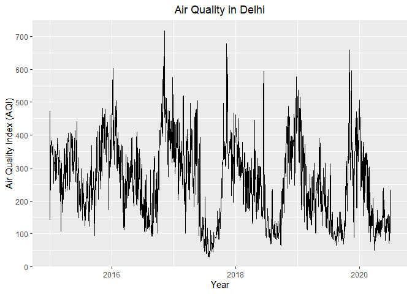<!-- -->
### Convert to a TS object


### Inspect Trend & Seasonality
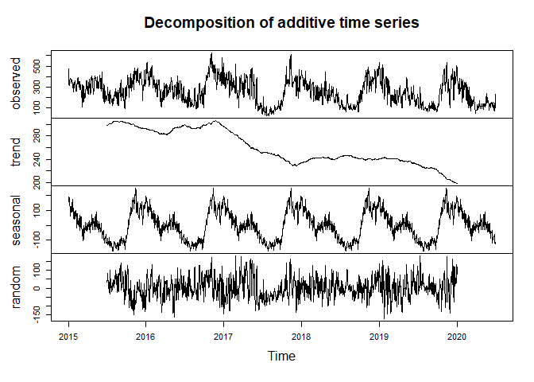<!-- -->


### xts object to convert to monthly (to check for seasonality)


### Seasonal Plot
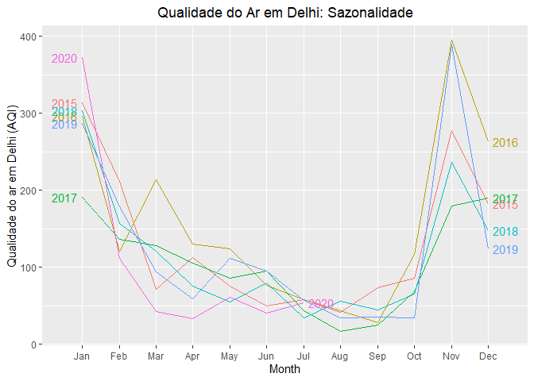<!-- -->

### Seasonal Plot
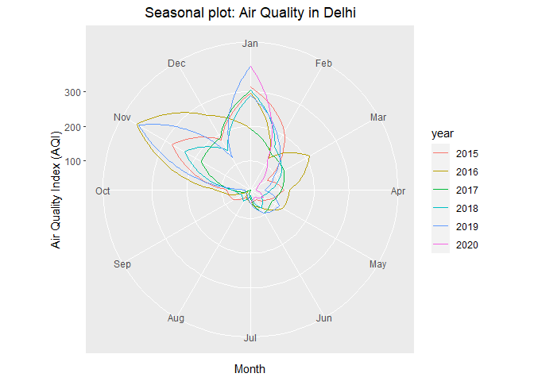<!-- -->

### Seasonal Plot
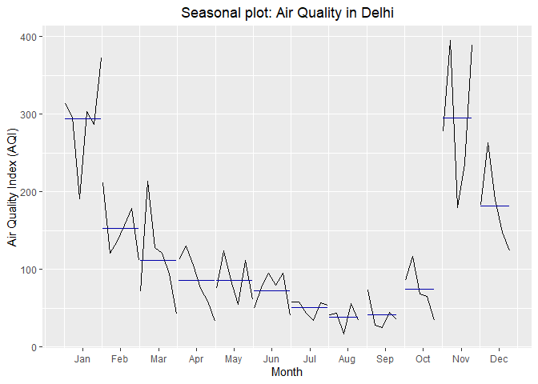<!-- -->

### Lag Plot
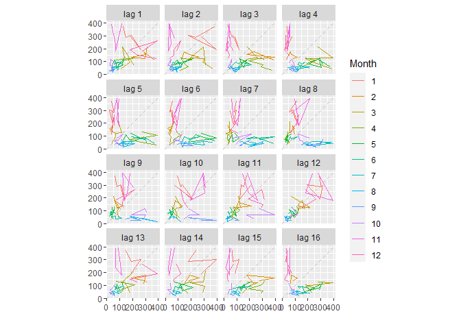<!-- -->

### Convert to weekly time series


### Seasonal Plot: weekly
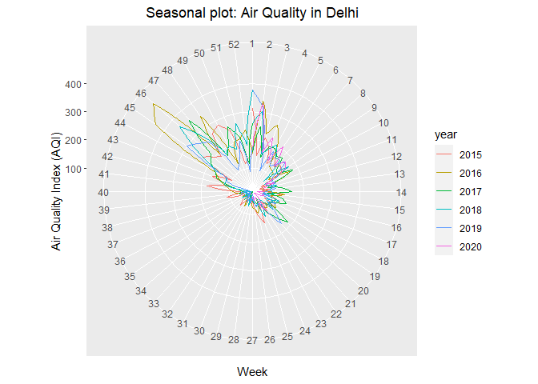<!-- -->


### Train test split
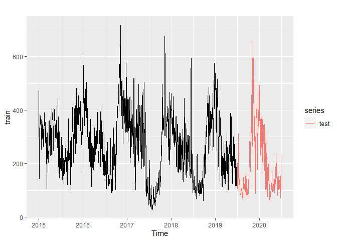<!-- -->

### stationarity-test

```
## Warning in adf.test(train): p-value smaller than printed p-value
```

```
## 
## 	Augmented Dickey-Fuller Test
## 
## data:  train
## Dickey-Fuller = -4.0386, Lag order = 11, p-value = 0.01
## alternative hypothesis: stationary
```

```
## 
## 	KPSS Test for Trend Stationarity
## 
## data:  train
## KPSS Trend = 0.18221, Truncation lag parameter = 8, p-value = 0.02267
```


### Box-Cox

```
## [1] 1.161026
```

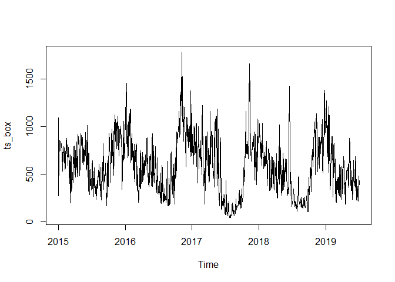<!-- -->

### check constant variance arch-test 

```r
archTest(ts_box, lag=10)
```

```
## Q(m) of squared series(LM test):  
## Test statistic:  6423.975  p-value:  0 
## Rank-based Test:  
## Test statistic:  8466.374  p-value:  0
```

### check n diffs

```r
ndiffs(ts_box)
```

```
## [1] 1
```

```r
nsdiffs(ts_box)
```

```
## Warning: The time series frequency has been rounded to support seasonal
## differencing.
```

```
## [1] 1
```

```r
# decide if one or two diff 365
ts_diff = (diff(diff(ts_box,365)))
plot(ts_diff)
```

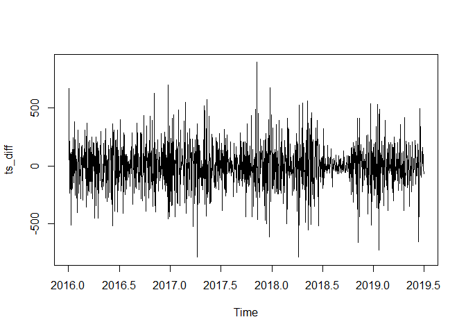<!-- -->

```r
acf(ts_diff, lag = 365)
```

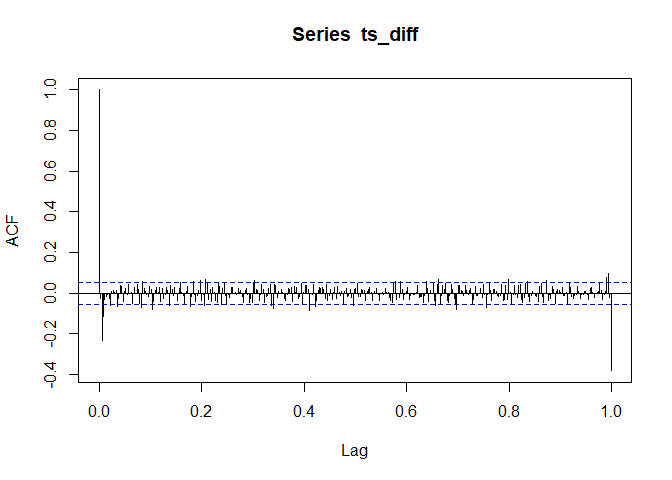<!-- -->

### stationarity-test

```
## Warning in adf.test(ts_diff): p-value smaller than printed p-value
```

```
## 
## 	Augmented Dickey-Fuller Test
## 
## data:  ts_diff
## Dickey-Fuller = -16.007, Lag order = 10, p-value = 0.01
## alternative hypothesis: stationary
```

```
## Warning in kpss.test(ts_diff, null = "Trend"): p-value greater than printed p-
## value
```

```
## 
## 	KPSS Test for Trend Stationarity
## 
## data:  ts_diff
## KPSS Trend = 0.0039212, Truncation lag parameter = 7, p-value = 0.1
```

### ACF & PACF
<!-- -->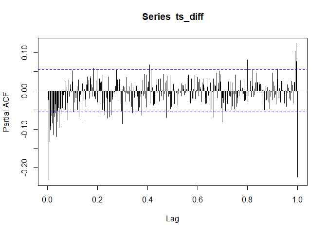<!-- -->


### Auto - Arima 

```
## Warning: The time series frequency has been rounded to support seasonal
## differencing.
```

```
## Series: train 
## ARIMA(3,0,0)(0,1,0)[365] with drift 
## 
## Coefficients:
##          ar1      ar2     ar3    drift
##       0.8448  -0.2025  0.1071  -0.0441
## s.e.  0.0278   0.0361  0.0280   0.0217
## 
## sigma^2 estimated as 5064:  log likelihood=-7262.33
## AIC=14534.65   AICc=14534.7   BIC=14560.42
```


```r
Box.test(resid(arima),type="Ljung",lag=20,fitdf=3) #fitdiff (p+q)
```

```
## 
## 	Box-Ljung test
## 
## data:  resid(arima)
## X-squared = 26.624, df = 17, p-value = 0.06383
```

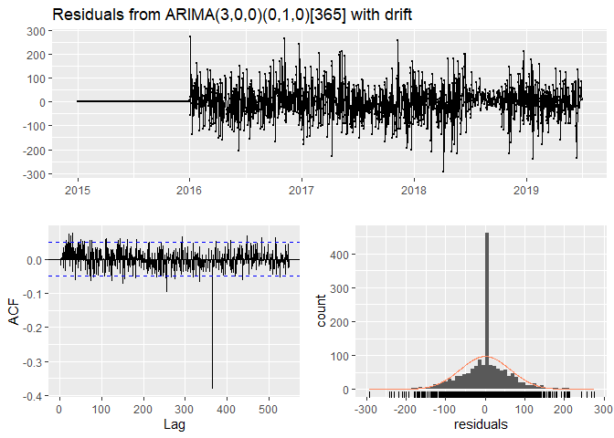<!-- -->

```
## 
## 	Ljung-Box test
## 
## data:  Residuals from ARIMA(3,0,0)(0,1,0)[365] with drift
## Q* = 598.28, df = 325, p-value < 2.2e-16
## 
## Model df: 4.   Total lags used: 329
```

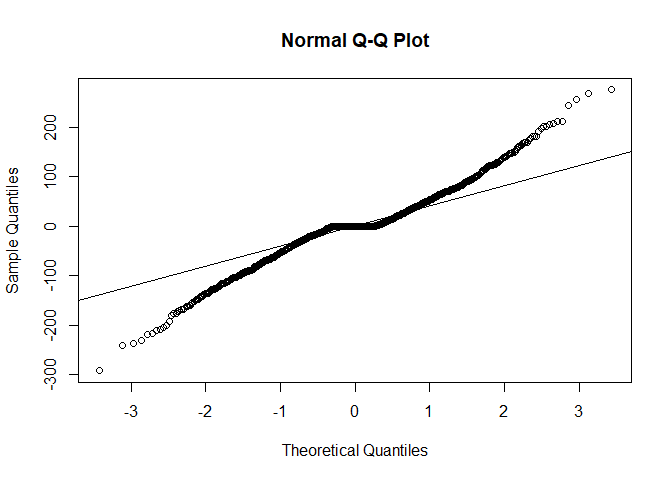<!-- -->

# ARIMA (8,1,1) (after having removed non-sig coeffs)

```r
arima2 <- Arima(train, order = c(1,1,2))
arima2
```

```
## Series: train 
## ARIMA(1,1,2) 
## 
## Coefficients:
##          ar1      ma1      ma2
##       0.4519  -0.5955  -0.2426
## s.e.  0.0480   0.0495   0.0338
## 
## sigma^2 estimated as 2598:  log likelihood=-8783.78
## AIC=17575.55   AICc=17575.58   BIC=17597.17
```


### Dynamic Harmonic regression

```r
dynamic <- list(aicc=Inf)
for(K in seq(5)) {
  fit <- auto.arima(train, xreg=fourier(train, K=K),
    seasonal=FALSE)
  if(fit[["aicc"]] < dynamic[["aicc"]]) {
    dynamic <- fit
    bestK <- K
  }
}

dynamic
```

```
## Series: train 
## Regression with ARIMA(1,1,3) errors 
## 
## Coefficients:
##          ar1      ma1      ma2     ma3   S1-365    C1-365    S2-365   C2-365
##       0.6044  -0.8066  -0.2324  0.0694  12.7747  104.5622  -68.2183  12.0026
## s.e.  0.0632   0.0693   0.0353  0.0468   9.3541    9.0498    6.2200   6.1038
##        S3-365   C3-365   S4-365    C4-365   S5-365  C5-365
##       10.3466  -1.8447  20.9448  -15.9258  15.8663  6.9406
## s.e.   5.4216   5.3612   5.1073    5.0656   4.9263  4.8951
## 
## sigma^2 estimated as 2472:  log likelihood=-8737.96
## AIC=17505.92   AICc=17506.21   BIC=17586.97
```
### ets

```r
stlf_fit = stlf(train, level = 95, method = "arima")
#stlf_fit
```

### Compare AIC

```r
barplot(c(auto_ARIMA = arima$aic, arima2 = arima2$aic, dynamic_Harmonic_reg = dynamic$aic),
        col = "light blue",
        ylab = "AIC")
```

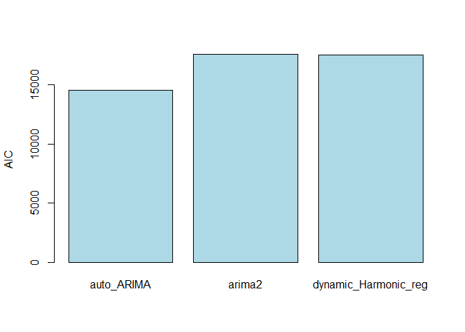<!-- -->
### metrics of different models

### FORECAST

### Forecast

```r
#arima2 %>%
  #forecast(train, h=365, level = 95) %>%
  #autoplot() + autolayer(test)
```

# EXPONENTIAL SMOOTHING MODELS

```r
ts %>%
  stl(t.window=365, s.window=365) %>%
  autoplot() 
```

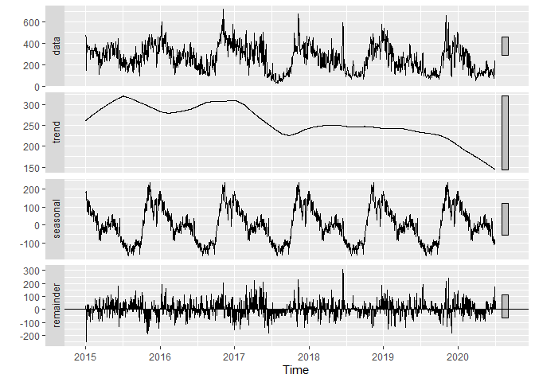<!-- -->


```r
#ETS = c('ANN','ANA','ANM', 'AAN','AAA', 'AAM', 'AAdN','AAdA', 'AAdM')

#AIC <- c()
#BIC <- c()
#AICc <- c()
#for (i in 1:9){
#    b<-es(ts,model=t[i])
#    AIC[i] <- AIC(b)
#    BIC[i] <- BIC(b)
#    AICc[i] <- AICc(b)
#}

e2_final <- es(ts,model='MNA',holdout=TRUE,silent=FALSE,interval=TRUE,h=365,level=0.95)
```

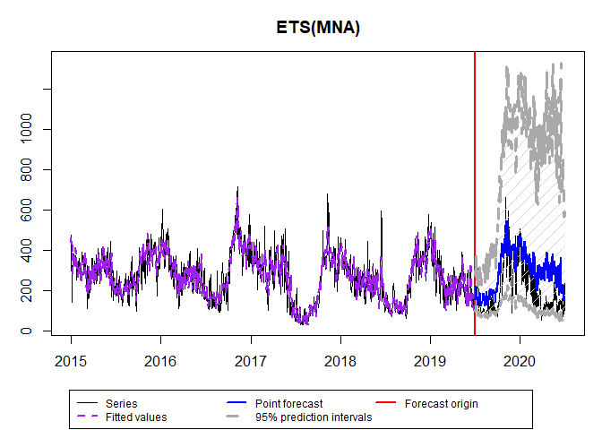<!-- -->

## Python - LSTM
### multiprocessing

```r
sys <- import("sys")
exe <- file.path(sys$exec_prefix, "pythonw.exe")
sys$executable <- exe
sys$`_base_executable` <- exe
multiprocessing <- import("multiprocessing")
multiprocessing$set_executable(exe)
```


```python
import os
os.environ["CUDA_VISIBLE_DEVICES"] = "-1"
from tensorflow.python.client import device_lib
```


```python
# https://machinelearningmastery.com/how-to-develop-lstm-models-for-time-series-forecasting/

import numpy
import matplotlib.pyplot as plt
from pandas import read_csv
import math
from keras.models import Sequential
from keras.layers import Dense
from keras.layers import LSTM
from sklearn.preprocessing import MinMaxScaler
from sklearn.metrics import mean_squared_error
# convert an array of values into a dataset matrix
def create_dataset(dataset, look_back=1):
	dataX, dataY = [], []
	for i in range(len(dataset)-look_back-1):
		a = dataset[i:(i+look_back), 0]
		dataX.append(a)
		dataY.append(dataset[i + look_back, 0])
	return numpy.array(dataX), numpy.array(dataY)
# fix random seed for reproducibility
numpy.random.seed(7)
# load the dataset
dataframe = read_csv(r"C:\Users\nunok\Documents\Msc Data Science\time series\project\delhi_air_quality\city_day.csv", engine='python')
dataframe = dataframe[dataframe["City"] == "Delhi"]
dataframe = dataframe[["AQI"]]
#dataframe.astype(int)
dataframe = dataframe.dropna()
#dataframe = read_csv(r"C:\Users\nunok\Documents\Msc Data Science\time series\project\dataset.csv", usecols=[1], engine='python')
dataset = dataframe.values
dataset = dataset.astype('float32')
# normalize the dataset
scaler = MinMaxScaler(feature_range=(0, 1))
dataset = scaler.fit_transform(dataset)
# split into train and test sets
train_size = int(len(dataset) * 0.82)
test_size = len(dataset) - train_size
train, test = dataset[0:train_size,:], dataset[train_size:len(dataset),:]
# reshape into X=t and Y=t+1
look_back = 1
trainX, trainY = create_dataset(train, look_back)
testX, testY = create_dataset(test, look_back)
# reshape input to be [samples, time steps, features]
trainX = numpy.reshape(trainX, (trainX.shape[0], 1, trainX.shape[1]))
testX = numpy.reshape(testX, (testX.shape[0], 1, testX.shape[1]))
# create and fit the LSTM network
model = Sequential()
model.add(LSTM(4, input_shape=(1, look_back)))
model.add(Dense(1))
model.compile(loss='mean_squared_error', optimizer='adam')
model.fit(trainX, trainY, epochs=50, batch_size=1, verbose=2)
# make predictions
```

```
## Epoch 1/50
## 1637/1637 - 13s - loss: 0.0218
## Epoch 2/50
## 1637/1637 - 1s - loss: 0.0070
## Epoch 3/50
## 1637/1637 - 1s - loss: 0.0062
## Epoch 4/50
## 1637/1637 - 1s - loss: 0.0061
## Epoch 5/50
## 1637/1637 - 1s - loss: 0.0061
## Epoch 6/50
## 1637/1637 - 1s - loss: 0.0061
## Epoch 7/50
## 1637/1637 - 1s - loss: 0.0061
## Epoch 8/50
## 1637/1637 - 1s - loss: 0.0061
## Epoch 9/50
## 1637/1637 - 1s - loss: 0.0061
## Epoch 10/50
## 1637/1637 - 1s - loss: 0.0061
## Epoch 11/50
## 1637/1637 - 2s - loss: 0.0060
## Epoch 12/50
## 1637/1637 - 2s - loss: 0.0060
## Epoch 13/50
## 1637/1637 - 2s - loss: 0.0061
## Epoch 14/50
## 1637/1637 - 1s - loss: 0.0061
## Epoch 15/50
## 1637/1637 - 1s - loss: 0.0061
## Epoch 16/50
## 1637/1637 - 1s - loss: 0.0061
## Epoch 17/50
## 1637/1637 - 2s - loss: 0.0061
## Epoch 18/50
## 1637/1637 - 1s - loss: 0.0060
## Epoch 19/50
## 1637/1637 - 1s - loss: 0.0061
## Epoch 20/50
## 1637/1637 - 1s - loss: 0.0060
## Epoch 21/50
## 1637/1637 - 1s - loss: 0.0061
## Epoch 22/50
## 1637/1637 - 1s - loss: 0.0060
## Epoch 23/50
## 1637/1637 - 1s - loss: 0.0061
## Epoch 24/50
## 1637/1637 - 1s - loss: 0.0060
## Epoch 25/50
## 1637/1637 - 1s - loss: 0.0060
## Epoch 26/50
## 1637/1637 - 1s - loss: 0.0060
## Epoch 27/50
## 1637/1637 - 1s - loss: 0.0060
## Epoch 28/50
## 1637/1637 - 1s - loss: 0.0060
## Epoch 29/50
## 1637/1637 - 1s - loss: 0.0060
## Epoch 30/50
## 1637/1637 - 2s - loss: 0.0060
## Epoch 31/50
## 1637/1637 - 2s - loss: 0.0060
## Epoch 32/50
## 1637/1637 - 2s - loss: 0.0060
## Epoch 33/50
## 1637/1637 - 2s - loss: 0.0060
## Epoch 34/50
## 1637/1637 - 2s - loss: 0.0060
## Epoch 35/50
## 1637/1637 - 2s - loss: 0.0061
## Epoch 36/50
## 1637/1637 - 2s - loss: 0.0060
## Epoch 37/50
## 1637/1637 - 1s - loss: 0.0060
## Epoch 38/50
## 1637/1637 - 1s - loss: 0.0060
## Epoch 39/50
## 1637/1637 - 1s - loss: 0.0060
## Epoch 40/50
## 1637/1637 - 1s - loss: 0.0060
## Epoch 41/50
## 1637/1637 - 1s - loss: 0.0060
## Epoch 42/50
## 1637/1637 - 1s - loss: 0.0060
## Epoch 43/50
## 1637/1637 - 1s - loss: 0.0060
## Epoch 44/50
## 1637/1637 - 1s - loss: 0.0060
## Epoch 45/50
## 1637/1637 - 1s - loss: 0.0059
## Epoch 46/50
## 1637/1637 - 1s - loss: 0.0060
## Epoch 47/50
## 1637/1637 - 1s - loss: 0.0060
## Epoch 48/50
## 1637/1637 - 1s - loss: 0.0060
## Epoch 49/50
## 1637/1637 - 1s - loss: 0.0060
## Epoch 50/50
## 1637/1637 - 1s - loss: 0.0060
## <keras.callbacks.History object at 0x000000007015DFD0>
```

```python
trainPredict = model.predict(trainX)
testPredict = model.predict(testX)
# invert predictions
trainPredict = scaler.inverse_transform(trainPredict)
trainY = scaler.inverse_transform([trainY])
testPredict = scaler.inverse_transform(testPredict)
testY = scaler.inverse_transform([testY])
# calculate root mean squared error
trainScore = math.sqrt(mean_squared_error(trainY[0], trainPredict[:,0]))
print('Train Score: %.2f RMSE' % (trainScore))
```

```
## Train Score: 52.78 RMSE
```

```python
testScore = math.sqrt(mean_squared_error(testY[0], testPredict[:,0]))
print('Test Score: %.2f RMSE' % (testScore))
# shift train predictions for plotting
```

```
## Test Score: 44.69 RMSE
```

```python
trainPredictPlot = numpy.empty_like(dataset)
trainPredictPlot[:, :] = numpy.nan
trainPredictPlot[look_back:len(trainPredict)+look_back, :] = trainPredict
# shift test predictions for plotting
testPredictPlot = numpy.empty_like(dataset)
testPredictPlot[:, :] = numpy.nan
testPredictPlot[len(trainPredict)+(look_back*2)+1:len(dataset)-1, :] = testPredict

fig = plt.figure()
ax = fig.add_axes([0.1,0.1,0.8,0.8])

plt.plot(scaler.inverse_transform(dataset),label = "Observado")
#plt.plot(trainPredictPlot)
plt.plot(testPredictPlot, label = "Esperado")

plt.legend(bbox_to_anchor =(0.3, 0.8), ncol = 1)

ax.set_title('Previsão Qualidade do Ar em Delhi - LSTM')
ax.set_ylabel('AQI')
ax.set_xlabel('Ano')
ax.set_xticks([0,365,730,1095,1460,1825])
```

```
## [<matplotlib.axis.XTick object at 0x000000000B8D4FA0>, <matplotlib.axis.XTick object at 0x000000000B8D4F70>, <matplotlib.axis.XTick object at 0x000000000B8D4640>, <matplotlib.axis.XTick object at 0x000000000DA635B0>, <matplotlib.axis.XTick object at 0x000000000DA63D30>, <matplotlib.axis.XTick object at 0x000000000DA734C0>]
```

```python
ax.set_xticklabels(["2015","2016","2017","2018","2019","2020"])
```

```
## [Text(0, 0, '2015'), Text(365, 0, '2016'), Text(730, 0, '2017'), Text(1095, 0, '2018'), Text(1460, 0, '2019'), Text(1825, 0, '2020')]
```

```python
plt.show()
```

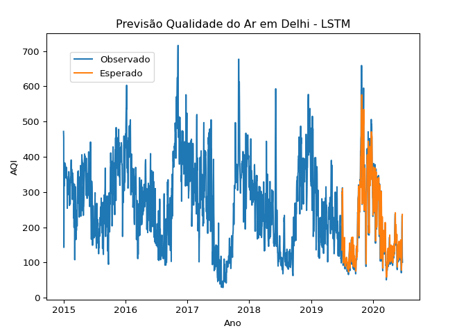
